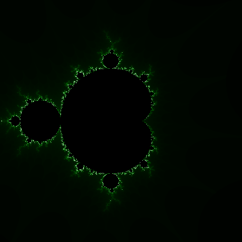
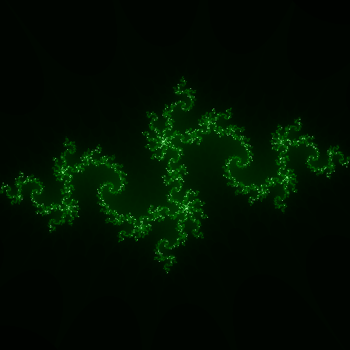
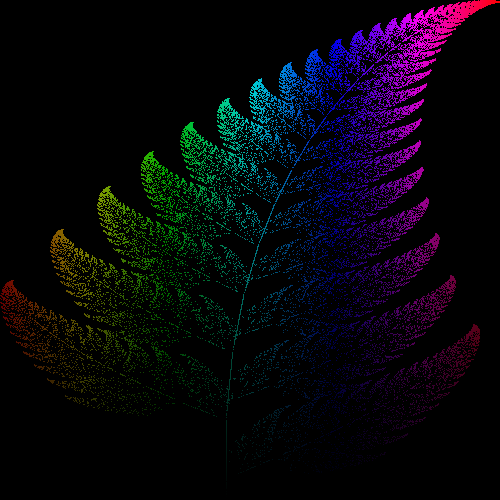
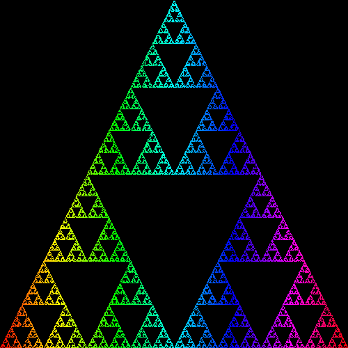
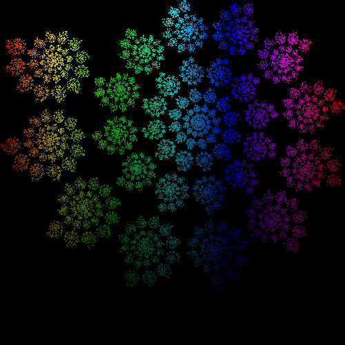
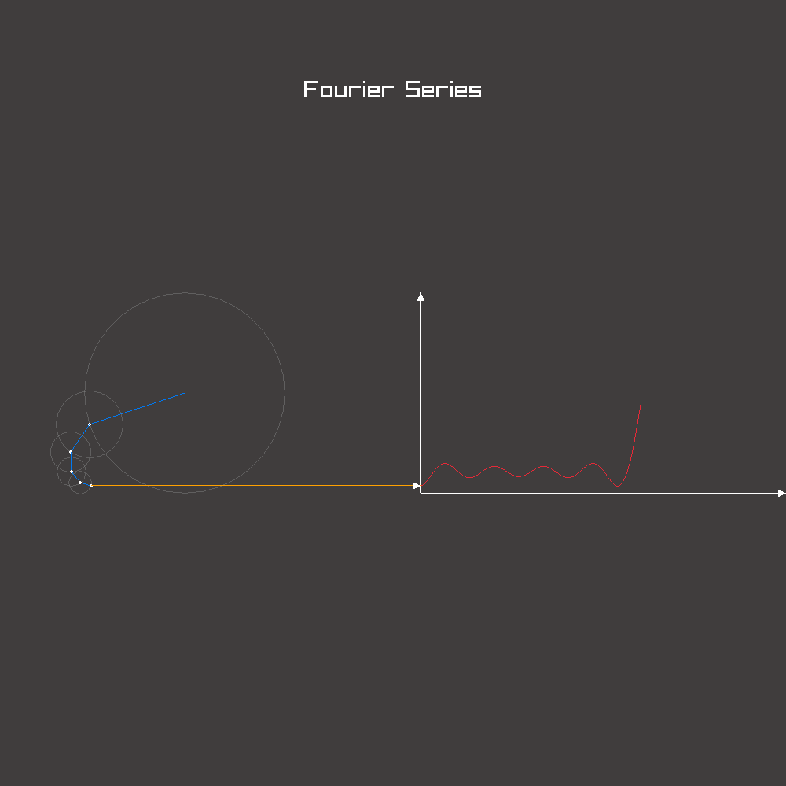
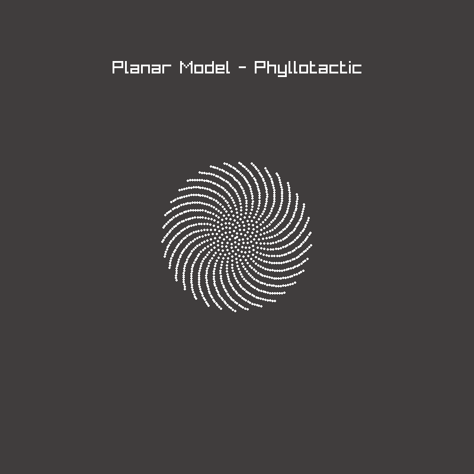

## Fractals

This repository contains my implementation of some famous fractals and shapes.

This was done using Raylib/C++.

---

### Showcase

#### Famous Mandelbrot set

---
#### Julia set

---

#### IFS Fractals

##### Barnsley fern

##### Sierpinski triangle

##### Spiral

---
#### Fourier Series

---

#### Phyllotactic - Planar Model

---
